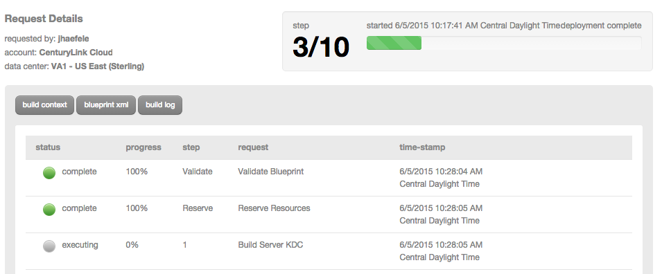

{{{
  "title": "Deploying Kerberos for Cloudera on CenturyLink Cloud",
  "date": "06-04-2015",
  "author": "John Haefele",
  "attachments": [],
  "contentIsHTML": false
}}}

##Overview

Cloudera Hadoop can be secured with Kerberos through the use of the Hadoop Kerberos addon. This walkthrough assumes you have an existing Cloudera cluster (make sure you know the **exact** name of this cluster).

###Deploy the Hadoop Kerberos addon

1\. Search for "kerberos" in the Blueprints Library. Then, click the "CLC Hadoop Kerberos addon".

2\. Click on the "Deploy Blueprint" button.

3\. Fill out the appropriate details for the CLC Hadoop Kerberos addon Blueprint. The Cloudera Cluster name is the name of you cluster; the Realm name is the Kerberos KDC Realm name.

  

>**Notes:**
- You must enter the EXACT Cloudera Cluster name in order for the Kerberos addon to deploy correctly.
- Best practice for Cluster name is no spaces
- Best practice for Realm name is all caps, no spaces

4\. Verify your configuration details.

6\. Once verified, click on the ‘deploy blueprint’ button.
You will see the deployment details along with an email stating the Blueprint is queued for execution.

You will receive a second email reporting that the addon Blueprint has been successfully deployed. You will receive two more email messages, the first letting you know that the Kerberos configuration is begun, and a follow-up upon completion. The amount of time needed for configuration will vary depending on the size of your cluster. **_Please do not use the servers until you have received this final email._**

###Other Resources
- More on configuring authentication in Cloudera: [Configuring Authentication in Cloudera Manager](http://www.cloudera.com/content/cloudera/en/documentation/core/latest/topics/cm_sg_authentication.html)
- Kerberos documentation: [Kerberos: The Network Authentication Protocol](http://web.mit.edu/Kerberos/)
- Kerberos 5 Release 1.8.6 Notes: (krb5-1.8.6) [Kerberos 5 Release 1.8.6 Notes](http://web.mit.edu/Kerberos/krb5-1.8/)